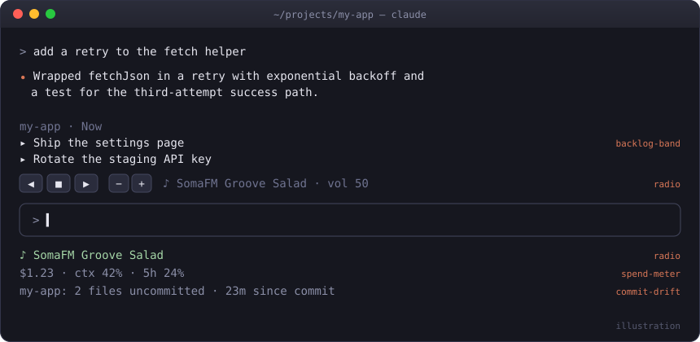

# claude-mods

Small mods for [Claude Code](https://claude.com/claude-code): status lines, a band above the prompt, a docked pane, and a radio. Each one is a plugin of function hooks.



## Install

```sh
claude plugin marketplace add sivori/claude-mods
claude plugin install radio@claude-mods        # or any mod below
```

Update later with `claude plugin marketplace update claude-mods`.

To try one without installing, clone the repo and run `claude --plugin-dir ./plugins/<mod>`.

## The mods

### radio
`/tune` streams internet radio inside Claude Code: SomaFM, lo-fi, classical and choral. (The command is `/tune` because Claude Code has a built-in `/radio`.) All your sessions share one player, so music started in two sessions never plays twice. Switching stations in any session replaces the current stream, and the status line shows what's playing everywhere. While something plays, a row of buttons sits above the prompt: ◀ ■ ▶ to change or stop, − + for volume.

```
/tune              toggle (resumes the last station); /tune listen just plays
/tune groove       pick by name, genre ("jazz", "choral") or number
/tune next | prev | stop | list
/tune vol 30       also vol +10 / vol -10
/tune band         hide or show the buttons
```

Plays through `mpv` (`brew install mpv`), which changes volume without a gap; otherwise `ffplay` from ffmpeg, which restarts the stream on each volume change.

By default the music keeps playing after you close Claude Code, until `/tune stop`. Turn on **stopWithLastSession** in `/config` to have it stop once no session is open; a watchdog catches a crashed session too, within about a minute.

### spend-meter
Session cost, context fill and 5-hour rate-limit use in the status line (`$1.23 · ctx 42% · 5h 24%`). It toasts once as spend passes $5, $10, $25, $50 and $100.

### commit-drift
Uncommitted file count and time since the last commit in the status line, for whichever repo you're editing. After an editing turn on a tree that hasn't been committed for 30+ minutes, it nudges you (at most every 10 minutes).

### backlog-band
Shows the open `## Now` items of the active repo's `BACKLOG.md` above the prompt. `/later <item>` appends to `## Next`, and `/backlog-band` hides or shows the band. It expects this format:

```markdown
## Now
- [ ] Blocking or imminent work

## Next
- [ ] The normal queue

## Someday
- [ ] Ideas

## Done
- [x] 2026-08-01 Completed
```

### day-recap
So you never start cold. While you work it records your prompts, the files edited and the commits made. Once the session has been quiet for 10 minutes, it asks the model for a two-line recap (what got done, the next step) and saves it per repo. When you next open Claude Code in that repo, the recap sits above the prompt until your first message:

```
↩ Last time in dash · yesterday 5:12pm
  Done: Added the spend chart and matched its colors.
  Next: Write a test for the empty-data case.
```

`/recap` writes it now, and `/recap last` brings back the one from last time. A session that did nothing leaves the earlier recap in place. If you quit before the recap is written, the next session writes it from the recorded activity with Haiku.

### quest-board
Three daily quests in a pane, drawn from the active repo: a `TODO`/`FIXME` comment to resolve, an open GitHub issue to close (needs `gh`), and a test command that failed to get passing. It picks one of each kind when it can, keeps the same board all day, and draws a new one tomorrow. A quest clears by itself when the TODO line is gone, the issue is closed or the test command passes. Each cleared quest gets a toast, and clearing all three gets a bigger one. The status line shows `⚔ quests 1/3`.

```
/quests             open the board
/quests reroll      swap the unfinished quests for new ones
/quests check       re-check the issues now (otherwise every 10 minutes)
```

### commonplace-pane
A docked pane of public-domain paintings from the [Art Institute of Chicago](https://api.artic.edu/docs/). Its "weather" follows your repo: calm landscapes while the tree is clean, overcast as changes pile up or commands fail, shipwrecks in a storm. The painting rotates every 20 minutes, and `/commonplace next` hangs a new one.

The images need a terminal with the kitty graphics protocol (kitty, Ghostty); elsewhere the pane shows the title and artist. It uses macOS `sips` to convert images. Paintings are cached in `~/.cache/commonplace-pane/`, which keeps the newest 30 and deletes the rest after each new painting. Two optional settings live in `/config`:

- **contact**: an email or URL sent in the museum's `AIC-User-Agent` header, as the Art Institute asks of API clients.
- **seedDir**: a folder of `seed-*.jpg` paintings to fall back on when the museum is unreachable.

## Developing

Each mod is `plugins/<name>/` with `.claude-plugin/plugin.json`, `hooks/hooks.json` and a `hooks/register.ts(x)` module. To check one:

```sh
claude plugin validate plugins/<name>
claude plugin test plugins/<name>
```

## License

MIT
